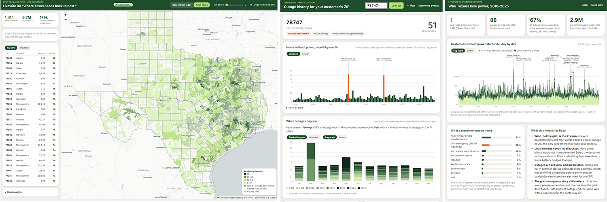

# Livewire BI



**Where Texas needs home backup next.** Livewire BI is a business-intelligence tool for Base Power. It ranks every Texas
ZIP code by how much it needs, and can buy, whole-home battery backup. It also shows which utility serves each area and
gives sales and marketing teams the outage story for any ZIP.

**Live demo:** https://keithkritselis.com/base/
Built solo for the **Base Power × AITX Talent Hackathon** (Austin, Sep 25–27, 2026). Tracks: **Open Grid Data** + **Most Commercializable**.

---

## The insight

We matched 74,000 notable county outage days (2018–2025) to NOAA storm reports. The biggest cause of lost power in Texas is
**wind, not the grid**:

| Cause | Share of outage hours, 2018–2025 |
|---|---|
| **High winds / severe thunderstorms** | **31%** |
| Grid emergency (Winter Storm Uri only) | 26% |
| Hurricanes / tropical storms | 14% |
| Flooding | 7% |
| No storm on record (equipment, animals, accidents) | 7% |
| Winter storm / ice | 6% |
| Extreme heat | 5% |
| Tornado + hail | 5% |

Of **88 outage events** that left 100,000+ Texans without power, only **one** was an ERCOT grid emergency: Winter Storm
Uri (Feb 2021, ~5M customers). The rest were local weather tearing down local lines: Hurricane Beryl (2.9M), the 2024
Houston derecho, the Memorial Day storms, Hurricane Nicholas, the 2023 Central Texas ice storm, and dozens of windstorms.
More power plants don't fix that. **Backup at the home does**, which is Base's product.

## Three views

### 1. Map (`index.php`)
- **~1,900 Texas ZIPs** colored by a 0–100 **Resilience Demand Score**, with county lines and city labels.
- **Utility filter:** check the utilities Base can sell in on the *By utility* tab. The map, totals and lead lists update
  instantly, and the selection is saved in the browser. The **Base today** preset selects Oncor, CenterPoint,
  AEP Texas Central/North and TNMP; **All of Texas** shows everything. As Base signs new utility agreements, a rep just
  ticks a box.
- **Explainable scores:** click a ZIP for its Need / Value / Ability breakdown, plain-English reasons ("Top 5% for
  severe-weather risk"), outage history, FEMA hazards and local electricity price.
- **Live model weights:** sliders re-weight Need / Value / Ability for the whole state.
- **Lead-list export (CSV):** every ZIP in the current view ranked with score, homes, income, top outage cause, peak season,
  worst event and a link to its sales view. The *By utility* export labels each utility as a direct-sale market,
  expansion target or partnership lead.
- Works on phones: sticky header, collapsible legend.

### 2. Sales call view (`rep.html?zip=77523`)
For a rep on the phone with a homeowner:
- **Outage timeline** for the customer's county, month by month from 2018 to 2025, with the storms they'll remember
  labeled ("Hurricane Beryl, Jul 2024 · 63% out"). Log/linear toggle.
- **When outages happen:** seasonality, stacked by year or as a heatmap, plus a one-line summary ("Peak season May–Jul;
  May has outages 8 of 8 years").
- **Talking points** and **what causes outages here**, each with a copy button.
- **Campaign brief:** audience, why this ZIP, when to run ads (before peak season, anniversary hooks), and draft angles
  picked from the county's actual outage causes (storm season, hurricane season, freeze readiness, Uri memory…).
  These are drafts to adapt, not final copy.

### 3. Statewide events (`events.html`)
- Daily timeline of Texans without power, 2018–2025, with the largest events labeled. Grid-wide events are orange;
  local ones are green.
- Cause breakdown, "What this means for Base" takeaways, and a filterable table of all 88 events. Clicking a row
  highlights the event on the chart.
- **Battery grid value by ERCOT zone:** typical-year and 2021 (Uri) earnings per kW for a home battery, plus price
  spikes per year, from ERCOT's own settlement prices.

## How the score works

`Score = 0.40 × Need + 0.30 × Value to Base + 0.30 × Ability & Ease`. Each part is a 0–100 Texas percentile, and the weights
are adjustable in the app.

| Part | Signals |
|---|---|
| **Need** | Outage hours per home, notable-outage days and restoration time after major outages (DOE EAGLE-I, 2018–2025); FEMA risk for hurricane, ice storm, winter weather, wind, tornado, cold and heat waves; share of all-electric homes (they lose heat in a winter outage) |
| **Value to Base** | Home size (median rooms), home value, electric load. Then a **battery grid value** nudge: what a 2-hour battery earns per kW-year from daily price swings in the ZIP's ERCOT load zone (15-minute real-time prices, 2018–2025, typical year excluding Uri). Zones worth more than the typical zone move Value up (West Texas about +3.5 points), cheaper ones move it down slightly; non-ERCOT ZIPs are unchanged |
| **Ability & Ease** | Household income, homeownership, long-term owners (Base plans run 36 months), new single-family construction |
| **Owned-homes filter** (always on) | 500+ residents, 40%+ owner-occupied, 50%+ single-family; other ZIPs (mostly renters/apartments) are greyed out |
| **Market** | Wires company per ZIP from the state's Power to Choose site; co-op / city / non-ERCOT utility from EIA-861 |

Missing data re-weights the other signals instead of counting as zero. Cutoffs live at the top of `build_scores.py`.

## Data pipeline

Plain Python (standard library only, no installs) → CSV/JSON → PHP + vanilla JS. No database.

```
fetch_data.py      DOE EAGLE-I outages (15-min snapshots, ~10 GB streamed, Texas kept; stuck readings and duplicates
                   removed) + Census ACS by ZIP → county outage stats, statewide daily peaks
fetch_extra.py     FEMA National Risk Index (county + census tract → ZIP), extra Census columns, building permits
fetch_utility.py   Power to Choose (every Texas ZIP) + EIA-861 via NREL → utility and market per ZIP, local prices
fetch_shapes.py    Census TIGERweb → simplified ZIP and county boundaries (GeoJSON)
fetch_events.py    NOAA Storm Events → cause of every notable county outage day; statewide events (grid-wide vs local)
fetch_duration.py  restoration time after major outages (5%+ of a county out) and average outage length, per county
fetch_ercot.py     ERCOT real-time load-zone prices (report 13061) → battery arbitrage value and price spikes per zone
build_scores.py    joins everything → data/tx_zip_final.csv (+ map points) and data/tx_utility_summary.csv
```

### Run it

```bash
python fetch_data.py        # first run downloads ~10 GB (cached in data/raw/, git-ignored); ~20–30 min
python fetch_extra.py       # can run alongside fetch_data.py
python fetch_utility.py     # ~2,300 Power to Choose lookups, ~5–10 min, resumable
python fetch_shapes.py      # ~1–3 min
python fetch_events.py      # after fetch_data.py; downloads ~90 MB of NOAA files once
python fetch_duration.py    # after fetch_data.py; ~2–4 min, no downloads
python fetch_ercot.py       # downloads ~100 MB of ERCOT price files once; ~3–6 min to parse
python build_scores.py      # seconds
php -S localhost:8000       # open http://localhost:8000
```

The processed files in `data/` are committed, so the app runs right after cloning. The fetch scripts are only needed to
rebuild the data.

### Deploying
Upload the web files plus `data/*.csv`, `data/*.json` and `data/*.geojson` (not `data/raw/`). After editing CSS or JS,
bump the version string (`$v` in `index.php`, `?v=` in `rep.html` / `events.html`) so browsers and host caches load the
new files. When uploading through cPanel, check **Overwrite existing files**.

## Repo layout

```
index.php            map page (PHP loads the data; markup only)
rep.html             sales call view
events.html          statewide events
api.php              JSON for one ZIP (used by the sales view)
css/  map.css · rep.css · events.css
js/   map.js  · rep.js  · events.js
build_scores.py      scoring model
fetch_*.py           data pipeline
data/*.csv|json|geojson  processed data (committed)
data/raw/            download cache (git-ignored)
DESIGN.md            Base brand tokens used for styling
```

## Data sources

- **DOE EAGLE-I** county power outages, © Oak Ridge National Laboratory, CC BY 4.0, doi:10.6084/m9.figshare.24237376
- **NOAA NCEI Storm Events Database**, 2018–2025 (outage causes, storm names)
- **FEMA National Risk Index** (Dec 2025), counties and census tracts
- **U.S. Census Bureau:** ACS 2020–2024 5-year, 2020 ZIP (ZCTA) relationship files and Gazetteer, TIGERweb boundaries,
  Building Permits Survey 2022–2024
- **ERCOT** Historical RTM Load Zone and Hub Prices (report 13061), 15-minute settlement point prices, 2018–2025
- **PUCT Power to Choose:** open-market plans and wires company per ZIP
- **DOE/NREL Utility Rates by ZIP (2024)**, from EIA Form 861
- Basemap © OpenStreetMap contributors © CARTO

## Limitations

- Outage history is **county-level**; every ZIP in a county shares it. Stuck utility-map readings (the same count for 3+
  days) are removed, and the top 1% of values is capped.
- Outage causes come from matching dates to NOAA reports. A day is attributed to a storm reported in that county
  (±1 day), a storm's restoration tail (up to 14 days), or the day's dominant regional storm. Four widely reported
  unnamed events (Houston derecho, Memorial Day storms, Central Texas ice storm, Dallas windstorm) are named by date.
- Restoration time = hours from the peak of a major outage (5%+ of a county's customers, min. 500) until 90% are back on.
  Some counties have only 10–20 such events, so treat exact county values as rough; the regional pattern (slowest on the
  Gulf Coast and in East Texas, fastest in open West Texas) is the reliable part.
- A "notable outage day" means 2%+ of a county's customers were out at once, usually a small area for a few hours.
- Each ZIP's ERCOT load zone is approximated from its utility and location (Houston = CenterPoint, Austin Energy and CPS
  are their own zones, and so on); non-ERCOT areas get no grid value. The arbitrage figure is a simple proxy (perfect
  foresight of each day's cheapest and priciest 2 hours), not Base's actual dispatch revenue.
- Utility per ZIP comes from one Power to Choose lookup; ZIPs on a service boundary can be split in reality.
- Scores rank ZIPs against each other. They're a targeting aid, not a sales forecast. Campaign briefs are drafts to be
  checked against Base's brand and product claims.

## Next steps

- Nodal (bus-level) prices instead of load zones for finer grid value
- Stack monthly outage hours by cause in the sales view
- ZIP-level outage data where utilities publish it

---

Styling follows Base Power's public brand using free substitute fonts; no Base font or logo files are included.
Built for the Base Power × AITX Hackathon. **Not an official Base product.** MIT License, see `LICENSE`.
